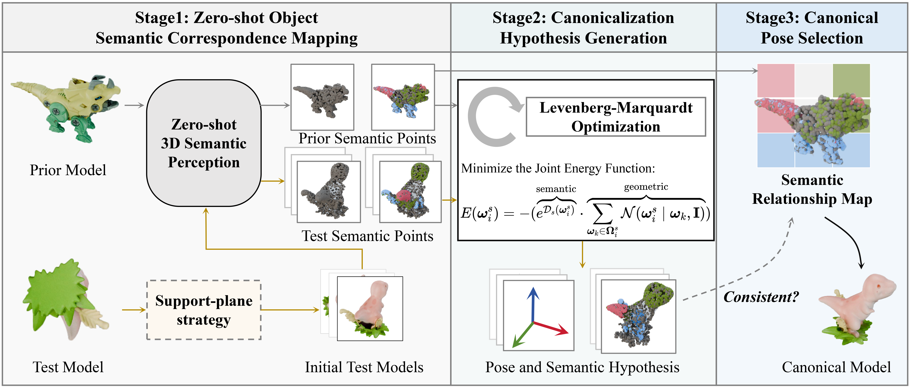

[](https://jinli998.github.io/One-shot_3D_Object_Canonicalization/)

# One-shot 3D Object Canonicalization based on Geometric and Semantic Consistency（CVPR 2025）
This project offers the Canonical Objaverse Dataset, created using the methods outlined in the paper "One-shot 3D Object Canonicalization based on Geometric and Semantic Consistency." Additionally, the project provides an Objaverse toolkit that includes functionalities for downloading Objaverse data, converting GLB files to OBJ format, loading canonical poses, and more.


## ✅ TODO List

 - [x] Release COD dataset and toolkit.
 - [ ] Release paper on arxiv.

 ## 📋 Table of content
 1. [💡 Overview](#1)
 2. [📖 Dataset](#2)
 3. [✏️ Usage](#3)
 4.  [🔍 Citation](#4)

 ## 💡Overview <a name="1"></a> 
<p align="center">
     <br />
    <em> 
    </em>
</p>

## 📖 Dataset <a name="2"></a> 
<p align="center">
     <br />
    <em> 
    </em>
</p>

## ✏️ Usage <a name="3"></a> 
### Dataset toolkit <a name="31"></a> 
#### Requirements
The code has been tested with
- python 3.10
- pytorch 1.9.0
- pytorch3d 0.7.5
- open3d 0.14.1

#### Project Structure
```
├── Example
│   ├── load_canonicalData.py # A pipeline that includes downloads, format conversion, and canonicalization
├── Src
│   ├── DataDownload
│   │   ├── Download.py # Download Objaverse Data from internet
│   │   └── ..
│   ├── Glb2Obj
│   │   ├── glb2Obj.py  # Convert GLB files to OBJ format
│   │   └── ..
│   └── Obj2Canonicalization
│   │   ├── canon_obj.py  # Load canonical labels on object canonicalization
│   │   └── ..
│   └── structure
│   │   ├── ..
│   └── utils
│   │   ├── ..
├── data
    ├── CanonicalObjaverseDataset.json  # Canonicalization labels
    └── canon-annotations.json # Category and object's UID
```

#### Data Processing
To test the model, please run:

```
python -m Examples.load_canonicalData --data_name 'test' 
```

To get all the COD datasets, please run:

```
python -m Examples.load_canonicalData --data_name 'canon' 
```

## 🔍 Citation <a name="4"></a> 

```
Coming soon.
```

## Acknowledgement
This work was completed during a visit to the Visual Computing and Learning Laboratory at Peking University. Special thanks to [Prof. Baoquan Chen](https://baoquanchen.info/) and the co-authors for their support. Grateful acknowledgment is extended to [Prof. Pengshuai Wang](https://wang-ps.github.io/), [Prof. Xifeng Gao](https://scholar.google.com/citations?user=wSUVcN0AAAAJ&hl=en), and [Prof. Mengyu Chu](https://rachelcmy.github.io/) for their guidance and discussions. Thanks also to [Kai Ye](https://illusive-chase.github.io/), [Jia Li](lirity1024@outlook.com), and Yuhang He for their assistance.